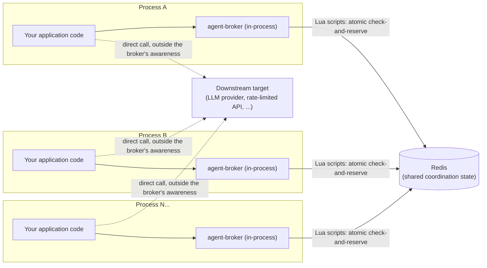
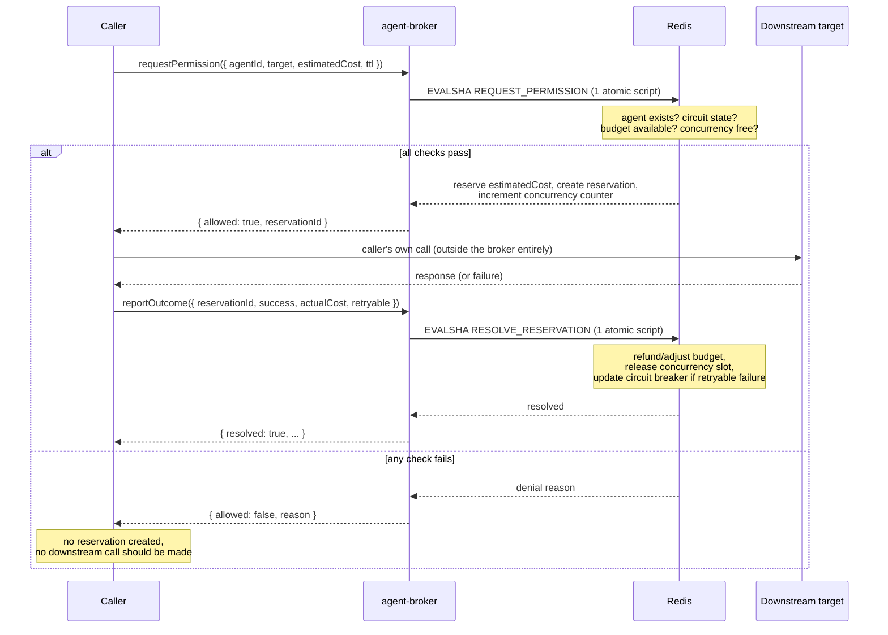
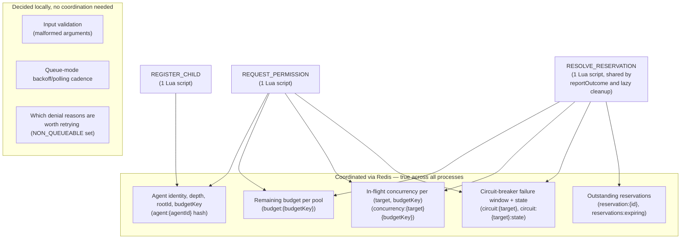

# agent-broker — Architecture & Design Document

## Purpose of this document

This document was originally written as a complete handoff for an implementation session (human or AI coding agent) with **no prior context** about this project — it captured not just the intended design, but the reasoning that produced it, including rejected alternatives, because several of these decisions are non-obvious and an implementer who doesn't understand *why* a choice was made is at risk of "fixing" it incorrectly.

The library has since been built and tested, and this document has been **updated to reflect the system as it actually ships**, not just as it was originally planned. Everywhere the implementation diverged from the original design — a simplified circuit-breaker recovery model, a corrected refund-signaling mechanism, a key-naming scheme hardened against collision, and a few others — that divergence is called out explicitly in place, with a link to the ADR that records why. A short-lived, separate `architecture.md` summary document existed briefly alongside this one; its content has been fully folded back in here, and it has been removed so there is exactly one architecture document, not two that can drift apart again.

Read this document in full before making non-trivial changes. Section 20 (Known Limitations) and the ADR log (Section 21) are especially important — they document tradeoffs that are intentional, not oversights.

---

## 1. What This Project Is

`agent-broker` is an **in-process TypeScript library** that coordinates behavior across multiple independent, concurrently-running processes (agent instances) that each make calls to a shared downstream resource (an LLM provider, or in principle any external resource with a cost and a failure mode).

### The core problem it solves

When multiple independent processes each implement their own retry logic, budget tracking, and concurrency control, each process can appear well-behaved in isolation while the **aggregate** behavior across all of them is not. Concretely:

- Three separate processes each retry twice after a failure against the same downstream target. Each one, in isolation, looks like reasonable behavior ("I only retried twice"). Collectively, the downstream target receives a burst it has no way to anticipate, and none of the three processes can see the other two.
- Multiple processes spend from a logically shared budget (e.g. the same API key, the same user's allowance). Each process checks "do I have enough budget" independently, with no visibility into what the others are doing at that instant — creating a race where all can pass the check simultaneously and collectively overspend.
- One process recursively spawns sub-agents, which spawn further sub-agents. Nothing inherent to a single process stops this fan-out from growing unbounded, because depth is a property of the *whole tree*, which no single node can see on its own.

`agent-broker` exists to be the **shared, centralized point of visibility** that makes coordinated decisions possible — using Redis as the substrate that is actually shared across otherwise-unaware processes.

### What this project deliberately is NOT

- **Not an agent framework.** It has no concept of prompts, reasoning, planning, or what an agent is "trying to do." It knows nothing about task logic.
- **Not a general-purpose rate limiter**, though one of its three mechanisms (circuit breaking) is rate-limiter-*shaped*. The other two mechanisms (tree-based depth/delegation tracking, reservation-based cost accounting with estimate/actual reconciliation) are not reducible to rate limiting at all.
- **Not an LLM SDK.** It has no concept of prompts, models-as-a-first-class-object, streaming ergonomics, or provider-specific request/response shapes.
- **Not a call executor.** After significant design iteration (see ADR-9), the broker was deliberately pivoted to never execute downstream calls itself. It only grants/denies permission and records caller-reported outcomes.
- **Not a security boundary** in the adversarial sense. It prevents *accidental* and *architectural* bypasses (a caller can't accidentally spoof its own depth), but it explicitly does not defend against a fully malicious process owner who is willing to misreport outcomes. See Section 18.

---

## 2. The Three Core Problems, Restated Precisely

### A. Correlated / amplified retries

Independent processes retrying against the same downstream target around the same time can create an aggregate burst invisible to any single process. The broker needs shared, cross-process visibility into recent failure activity per target, and a mechanism to impose *coordinated* backpressure rather than let each process compute its own backoff blindly.

### B. Cost-based budget enforcement

Budgets should be based on actual cost consumption (tokens, or a cost-proportional unit), not raw request counts, and must be enforced centrally so that concurrent spenders — including multiple unrelated processes sharing a budget key, and multiple descendants in one delegation tree — cannot collectively overspend past what any single check would have allowed.

### C. Recursive sub-agent spawn-depth limits

Agents may delegate to sub-agents, which may recursively delegate further. The broker must centrally enforce a maximum depth, computed from broker-held state (not trusted from caller self-report), so that a bypass isn't as simple as a child claiming a lower depth than it actually has.

---

## 3. Technology Decisions

| Decision | Choice | Why |
|---|---|---|
| Language | TypeScript | Matches the developer's existing strength; the problem is I/O-bound coordination logic, not something requiring a different runtime. A later Go port is a plausible *second* project once the design is proven, not a v1 concern (see ADR list). |
| Runtime model | In-process library, not a standalone HTTP service | See ADR-2 rationale below — this was a deliberate, reasoned choice, not a default. |
| Shared coordination substrate | Redis | The one genuinely non-negotiable infrastructure choice — the whole point is state shared across independent processes, and Redis is what any number of separate processes can all connect to. |
| Redis connection ownership | Supplied by the consuming application at `createBroker()` time | The library never manages its own Redis connection or reads environment variables directly (ADR-3). This is also what gives isolation between unrelated systems "for free" — two apps pointed at different Redis instances share nothing. |
| Downstream execution | **Not owned by the broker at all** (post-pivot) | See ADR-9. The broker is a pure permission gate. |

### Why an in-process library, not an HTTP service

This was explicitly discussed and decided deliberately, not defaulted into:

- The developer had never designed a library's public API surface before (only HTTP endpoints) and specifically wanted to close that gap.
- The core coordination claim ("state shared across independent processes") is satisfied by the shared Redis instance underneath, **not** by the broker being a standalone service. Two separate Node processes, each importing the library, each pointed at the same Redis, get real cross-process coordination — the shared state lives in Redis, not in any process's memory.
- What a standalone HTTP service would add, that a library does not provide: the ability to enforce policy against a caller that doesn't want to comply. Since this project is about proving a coordination *design*, not defending against hostile callers, this tradeoff was accepted deliberately (see Section 18 for the full trust-boundary discussion).

---

## 4. System Boundaries

### Diagram A — System architecture

The broker is an **in-process library**, not a service: each application process links it
directly and calls its methods like any other function. There is no broker process to deploy or
scale independently — the only shared infrastructure is the Redis instance every process already
points at.



Two things this diagram is deliberately explicit about, because they're easy to misread from a
glance: the broker never sits between the caller and the downstream target — the dashed lines are
the caller's own direct calls, made entirely outside the broker. And every process's broker
instance talks to the *same* Redis — that shared state, not the library code, is what makes
coordination across processes possible at all (Section 18 covers what is and isn't shared this
way in more depth).

### What "agent" means to the broker

An agent is **not** a reasoning loop, a prompt, a model, or a task. To the broker, an agent is purely **a node in a delegation tree**, with:

- A broker-issued unique identity (never caller-chosen)
- A parent reference (or none, if root)
- A depth (broker-computed from parent, never self-reported)
- A `rootId` (the topmost ancestor — stored explicitly at registration, not re-derived by walking the chain each time, to keep lookups O(1))
- A `budgetKey` (inherited from root; see Section 6)

Everything about *why* the agent exists — its task, its prompts, its internal state — is entirely the consuming application's concern. The broker knows nothing about it and should never be extended to know about it.

### Delegation

A parent agent calls `register({ parentId })` on the broker **before** the child process/task actually starts doing anything. The broker:

1. Looks up the parent's stored depth and `rootId`
2. Computes child depth = parent depth + 1
3. Rejects if this exceeds the broker's configured `maxDepth`
4. If allowed, issues a new child identity, storing parent link, computed depth, and inherited `rootId`/`budgetKey`

The broker does not spawn processes and has no idea how the consuming application actually starts the child (env var, message passing, function argument — entirely the application's business).

### Downstream target

A `target` is an **opaque string key**, supplied by the caller, representing "which downstream thing is being called" — recommended convention is `provider:model` (e.g. `"groq:llama-3.3-70b-versatile"`), but the broker does not parse or validate this string's structure. It only uses it to group shared state (retry-correlation, concurrency limits). This granularity was chosen deliberately: provider-only would incorrectly lump together resources with very different rate-limit/cost characteristics; endpoint-level would be unnecessary complexity for a system that isn't a general HTTP proxy.

---

## 5. Request Lifecycle (Current, Post-Pivot)

**This supersedes an earlier version of this lifecycle** that assumed the broker executed downstream calls itself. That version is obsolete — see ADR-9.

### Diagram B — Request lifecycle



Everything inside the "all checks pass" branch's Redis step happens as a **single** `EVALSHA`
round trip — the diagram's separate-looking boxes under that `Note` are one atomic operation, not
sequential reads and writes a competing process could interleave with (Section 11 covers why that
matters). The caller's actual downstream call is the one step the broker has no visibility into
at all; everything it "knows" about that call's outcome comes second-hand from `reportOutcome`.

### Successful call

```
caller → broker.requestPermission({ agentId, target, estimatedCost, ttl, mode, queueTimeout? })
  → broker (single atomic Lua script) checks, in one combined operation:
       - does the agent exist and is its registration valid?
       - is the concurrency limit for this target+budgetKey currently exceeded?
       - is there enough budget remaining in this budgetKey's pool for estimatedCost?
       - what is the circuit-breaker state for this target — closed / open / recovering?
  → if all checks pass: broker atomically reserves estimatedCost, creates a reservation
    record with the caller-supplied TTL, increments the concurrency counter
  → broker returns { allowed: true, reservationId }

caller → (entirely outside the broker's awareness) performs its own downstream call,
          using whatever mechanism/SDK/HTTP client it wants

caller → broker.reportOutcome({ reservationId, success, actualCost?, costUnknown?, retryable? })
  → broker reconciles: releases the reservation, adjusts the budget pool (refunds the
    difference between estimated and actual, or accepts a bounded overrun if actual
    exceeded estimated — see Section 6), decrements the concurrency counter, and (if
    success: false) updates circuit-breaker state if retryable: true
```

**Critical honesty point:** the broker's knowledge of "did this call succeed" is entirely second-hand — it never sees a response, status code, or real usage data directly. It only knows what `reportOutcome` tells it. This is the direct, accepted cost of the pure-gate pivot (see ADR-9 and Section 18).

### Retry / downstream failure path

The broker does **not** own a retry loop. Each retry is simply another `requestPermission` call from the caller. The broker's role is to make each successive `requestPermission` call aware of aggregate recent failure state for that target (via the circuit-breaker mechanism, Section 7), so a caller's Nth attempt can be denied or delayed based on what *every* caller has recently experienced against that target — not just this caller's own count.

### Budget failure path

```
caller → broker.requestPermission({ ..., estimatedCost })
  → broker checks remaining budget for the resolved budgetKey
  → estimatedCost > remaining budget
  → broker denies **before any downstream call is attempted**, returns
    { allowed: false, reason: 'budget_exceeded' }
  → no reservation is created
```

### Delegation failure path

```
parent → broker.register({ parentId })
  → broker looks up parent's stored depth
  → computes child depth = parent depth + 1
  → if child depth > maxDepth: deny registration,
    { allowed: false, reason: 'depth_exceeded' }
  → else: create child identity with broker-computed depth/rootId/budgetKey
```

Depth validation happens at **registration** time, not call time — a rejected child never receives a valid identity, so it cannot make any `requestPermission` calls at all.

---

## 6. Agent / Delegation Model — Trust and Identity

This is one of the most important sections. The entire value of centralized depth/budget enforcement depends on the broker having **authoritative state that cannot be spoofed by a cooperating-but-careless or cooperating-but-dishonest caller** (with the explicit exception noted in Section 18 — see also the "deliberate evasion" limitation in Section 22).

### The general trust pattern used throughout this design

**A caller may reference existing broker state by ID. A caller may never supply derived facts about that state.** Concretely: a child registering may say "I am a child of parent X" (referencing an ID) — but depth, rootId, and budgetKey are always *computed by the broker* from its own stored records about parent X, never accepted as values the caller asserts about itself.

### Identity

Broker-issued at registration (e.g. a UUID). Never caller-chosen. If callers could choose their own IDs, one process could claim to *be* another agent and inherit its budget/depth state.

### Depth / parent / root

Computed once at registration, from the broker's own lookup of the parent's stored state, and **permanently immutable** thereafter (ADR-20). There is no update path for these fields — this is deliberate, not a missing feature. Allowing depth to be mutated post-registration would create a direct bypass of the entire protection depth is meant to provide.

### Budget key inheritance

Declared **only** at root registration (`register({ budgetKey: 'user-123', initialBudget: 5000 })`). A child's `register({ parentId })` call does **not** supply its own budget key — the broker looks up the parent's stored `budgetKey` and the child inherits it automatically, exactly like depth.

**Default behavior when `budgetKey` is omitted:** defaults to the *root's own broker-issued agent ID* — i.e., private-by-default. Each unrelated root automatically gets its own untouched budget pool. Explicit sharing across otherwise-unrelated roots (e.g., multiple app instances handling requests for the same user) requires **explicitly passing the same `budgetKey` string** at each root registration. This was a deliberate correction during design — an earlier idea of a single fixed default string (e.g. `"__default__"`) was rejected because it risked accidental, unintended budget sharing between unrelated features that both simply forgot to specify a key.

### Why `budgetKey` and delegation depth are orthogonal, not redundant

This came up explicitly during design and is worth stating clearly for the implementer: **`budgetKey` answers "who shares a spending ceiling" (a horizontal/cross-request concern). Delegation depth answers "how deep can one request's own internal fan-out go" (a vertical/within-one-tree concern).** A single root agent, with a budget key shared with nobody, can still spawn an unbounded recursive tree of children entirely on its own — budget-key sharing has nothing to do with that failure mode. Both mechanisms are necessary; neither substitutes for the other.

### Why a new incoming request doesn't need to "find" an existing agent to attach to

A related question that came up during design: if the same user makes a second request (from a different app instance, or a new request from the same instance), does the system need to detect an existing agent for that user and create a *child* of it, rather than a new root?

**No.** Each incoming unit of work is legitimately a **new root**, even if it shares a `budgetKey` with a previous, unrelated root. An agent ID identifies *one unit of work* (one request's call tree) — it is deliberately short-lived and per-request. The `budgetKey` is the thing that persists and is shared across requests. Trying to make a new request "find and reuse" a previous agent's ID would require a lookup-by-user registry with its own race conditions (concurrent instances racing to look it up, handling expired originals, etc.) to solve a problem that budget-key sharing already solves without any of that complexity. **Do not build an agent-lookup-by-key mechanism** — it was considered and deliberately rejected as unnecessary complexity.

### Lifecycle: TTL, heartbeat, deregistration

- Agent registrations carry a **TTL**, refreshed automatically as a side effect of every successful `requestPermission`/`reportOutcome` call from that agent (heartbeat-on-call). Active agents never expire; idle/crashed ones clean up automatically.
- **Explicit `deregister()`** is supported for well-behaved callers that want prompt cleanup rather than waiting out a TTL.
- **Graceful-shutdown hooks** (`SIGTERM`/`SIGINT`) in the consuming application can call `deregister()` proactively. This is a courtesy optimization, **not** a substitute for TTL-based expiry — it is a documented, physical fact that no code can run after a hard kill (`SIGKILL`, power loss, OOM-kill, segfault). TTL expiry is the actual safety net; graceful-shutdown hooks only shorten the cleanup window in the subset of cases where shutdown is orderly.
- **On process restart:** a restarted process registers as a **brand-new agent** (new identity). There is no mechanism, and none should be built, for a process to "resume" its previous identity after a crash — doing so safely would require a separate credential/proof system that is out of scope.

### Budget mutation

- `addBudget(budgetKey, amount)` — **additive only.** Supported because it's strictly safe: it cannot retroactively invalidate any already-granted decision.
- **No arbitrary "set budget to X" operation exists**, and none should be added. Setting an arbitrary value could erase a legitimately-incurred deficit from reconciliation overrun (see Section 7), effectively letting a caller cheat the accounting.
- Broker-level configuration (`maxDepth`, circuit breaker thresholds, etc.) is **immutable for the lifetime of a given broker instance** (ADR-19). If different limits are needed, create a new broker instance. This avoids the unsolvable question of "what happens to already-registered agents that become non-compliant if limits change mid-flight."

---

## 7. Budget / Cost Enforcement — Full Mechanics

### The core problem

Actual cost of an LLM call is not knowable until the response completes — input tokens can be estimated accurately (tokenization is deterministic), but output token count cannot be known in advance, and output tokens are often priced the same or higher than input tokens.

### Reservation, not direct deduction (this was a deliberately reasoned choice)

**Direct deduction** (only decrementing budget after a call completes) was considered and rejected: if two calls under the same `budgetKey` are in flight simultaneously, both can pass a "do we have enough budget" check before either has deducted anything, both proceed, and the pool can go negative by up to the sum of both calls' actual costs. This reintroduces exactly the "each instance looks locally fine, aggregate isn't" failure mode the entire project exists to prevent — just in the budget dimension instead of the retry dimension.

**Reservation** (atomically check-and-decrement by the *estimated* cost at admission time, reconcile against actual cost afterward) is the chosen mechanism, because it is the only one of the two that actually closes the concurrent-overspend race: a concurrent second call correctly sees reduced/zero budget immediately, even before either in-flight call has completed.

### Reconciliation

```
reserve(estimatedCost) → call happens (outside the broker) → reportOutcome(actualCost)
  → refund = estimatedCost - actualCost
  → apply refund to the budget pool (positive refund if actual < estimated,
    negative adjustment — i.e. further deduction — if actual > estimated)
```

**Explicit, accepted limitation:** if `actualCost > estimatedCost`, the pool can go **below zero** as a result of reconciliation. This is fundamentally unavoidable (you cannot un-generate tokens that were already produced), and is treated as a bounded, self-correcting overrun: the *next* `requestPermission` call against that pool will see the negative/insufficient balance and be denied. The overrun is bounded to roughly one call's worth of estimation error per occurrence, not unbounded.

**Mitigation, not elimination:** callers are encouraged to pad `estimatedCost` with a configurable safety margin (e.g., assume closer to max plausible output length rather than expected average) to make overruns rarer — at the cost of some reserved-but-unused budget sitting temporarily locked until refund. This is a real tradeoff between overrun frequency and reservation tightness, not a solved problem.

**Important distinction for the implementer:** "budget cannot go negative at admission time" (Invariant 5) and "budget can never go negative, period" are **not the same guarantee**. The pool *can* go negative via reconciliation overrun. Do not conflate these when implementing validation or writing documentation — they are subtly different, and stating them as identical would misrepresent the system's actual guarantee.

### Unknown cost handling

A successful call where the caller genuinely cannot determine real usage (e.g., the provider returned no usage metadata) is handled by simply omitting `actualCost` from `reportOutcome({ success: true })` — there is no separate `costUnknown` input field. The broker's fallback: release the *originally reserved estimated* cost back as the settled cost (best available information), and report `costUnknown: true` in its response, rather than silently defaulting to an arbitrary number like `1`, which was explicitly considered and rejected as dangerous — a plausible-looking wrong default would silently corrupt budget accounting in a way that's invisible until numbers stop adding up much later. See [ADR-0020](adr/0020-actualcost-and-costunknown.md) for why the implementation infers this from the absence of `actualCost` rather than a separate explicit flag, which was the original design here.

### `budgetKey` scope, restated for this section

Budget is scoped **per broker instance is not the granularity** — it is scoped **per `budgetKey`**, which lives *within* a single broker instance (single provider, single Redis connection). Multiple distinct `budgetKey` pools can and do coexist within one broker. Running multiple broker instances is the correct move only if you need genuinely separate providers/Redis connections/API keys — not for per-user isolation under one shared API key, which `budgetKey` already solves.

---

## 8. Concurrency Limiting

A separate mechanism from both depth and budget — this was an explicit correction made during design after an initial (incorrect) assumption that depth already covered concurrent-call volume. **It does not.** Depth constrains tree *shape* (how many delegation levels deep); it says nothing about how many calls are happening *simultaneously*. A tree capped at depth 3 could still have thousands of agents at depth 1 all calling at once — nothing about depth prevents that.

- Tracked per `target` + `budgetKey` combination (both dimensions may need independent limits — a global cap on a popular target, and/or a per-user cap).
- Enforced as an atomic increment/decrement, folded into the **same combined admission script** as the budget check (see Section 10) — not a separate round trip, to avoid reopening the exact race the design exists to close.
- **`mode: 'deny' | 'queue'`**, caller-specified per call. `'deny'` (the default) rejects immediately if the limit is currently hit. `'queue'` holds the request until a slot frees or `queueTimeout` elapses. `'deny'` is the safer, simpler default; `'queue'` is an explicit opt-in for callers who specifically want to wait rather than handle the denial themselves.

---

## 9. Retry Coordination — The Core Distributed-Systems Mechanism

### What the broker actually observes (post-pivot)

The broker never sees a downstream response. It only sees `requestPermission` calls and `reportOutcome` reports. **A "retry" is not a special kind of call** — from the broker's point of view, every `requestPermission` for a given target is just another attempt. Retry detection is really **"recent failure density against a target,"** inferred from the pattern of reported outcomes, not literally "counting retries" in any direct sense.

### Storage: sliding window via sorted set

`retries:{target}` — a Redis **sorted set**, member = a unique token per failure event (the associated `reservationId` is sufficient), score = the failure's timestamp. This allows efficient atomic trimming (`ZREMRANGEBYSCORE`, dropping anything older than the configured window) and counting (`ZCARD` after trim) — chosen specifically to avoid the "burst right at a fixed bucket boundary" edge case that a naive fixed-window counter would introduce.

### Only `retryable: true` failures count toward this state

`retryable` is a **caller-supplied classification** on `reportOutcome`, analogous to the developer's own existing `KEY_FAULT` / `PROVIDER_TRANSIENT` / `BAD_MODEL` / `NON_RETRYABLE` taxonomy from prior projects. It answers: "was this failure the kind of thing where retrying makes sense (transient — rate limit, timeout, temporary server error), or not (bad API key, malformed request — retrying will never help)?"

**This distinction is load-bearing and must not be skipped:** if non-retryable failures (e.g. a caller bug sending malformed requests) were folded into the same failure counter as genuine transient errors, a buggy-but-unrelated caller could wrongly trip the circuit breaker for a target that is actually perfectly healthy, denying every legitimate caller. Only `retryable: true` outcomes feed the circuit-breaker sorted set. Non-retryable failures are still reported (for the caller's own budget/concurrency reconciliation) but must not influence shared circuit state.

**Trust caveat, stated explicitly:** the broker has no independent way to verify a caller's `retryable` claim — it never sees the actual downstream error. A caller could misreport this, by bug or bad faith. This is an accepted, named limitation (see Section 18), not a gap that was overlooked.

### Circuit breaker: two states as shipped, two thresholds

This is a deliberately standard, well-understood pattern (not a novel invention) — the genuinely novel part of this design is that it is **coordinated across independent processes via Redis**, unlike most circuit breaker implementations which are per-process/in-memory.

- **Closed** (normal): calls proceed normally.
- **Soft threshold crossed** (e.g. 5 failures in the window, configurable): still `allowed: true`, but the response includes a `retryAfter` hint, scaling with how far past threshold the count is. This is coordinated backpressure — every caller against this target is told to slow down proportional to actual aggregate distress, not each caller's own independent guess.
- **Hard threshold crossed** (e.g. 20 failures in the window, configurable): circuit transitions to **open**. `requestPermission` returns `{ allowed: false, reason: 'circuit_open' }` for most calls. The circuit now opens the instant the threshold-crossing failure is reported via `reportOutcome`, not lazily on some later `requestPermission` call that happens to re-observe the count — see [ADR-0009](adr/0009-fire-and-forget-hooks.md)'s sibling decision recorded in the resolve-reservation script.
- **Recovery (the "half-open" problem):** if the circuit denies everyone, no successes can ever be reported, so the system would have no way to learn the target has recovered. Solution: while `open`, a small configurable fraction of calls (`probeRate`, e.g. ~10%) are still admitted through as **probes**.

**Divergence from the original design, recorded in [ADR-0010](adr/0010-single-probe-circuit-recovery.md):** this document originally specified a third `recovering` state, reached only after several consecutive probe successes. **As shipped, there are only two states — `closed` and `open`.** A single successful probe closes the circuit immediately and clears the entire failure window, in the same atomic script that resolves the reservation. This was a deliberate simplification made during implementation, not an oversight: with `probeRate` typically small, requiring several *consecutive* successes from an already-thin trickle of probes measurably lengthens how long a genuinely recovered target stays needlessly gated, for a benefit (avoiding one bad reopen) that is probabilistic and modest — and a false-positive single-probe recovery is cheap to correct, since the very next failure starts rebuilding the window from a clean slate toward the same `hardThreshold` as any other failure streak. See ADR-0010 for the full reasoning and the rejected multi-probe alternative.

### A race that must not be overlooked

The "1-in-N probe" decision must be part of the same atomic operation as everything else — if implemented as a separate read-then-decide step ("read current probe count, if under threshold allow"), concurrent callers could all read the same pre-increment state and all be simultaneously admitted as probes, breaking the "only a trickle" guarantee at exactly the moment the target is most fragile. This must be folded into the single combined Lua script (Section 10), not a separate operation.

---

## 10. Redis Data Model

**Divergence from the original design:** the key patterns below are updated to what actually shipped. The original draft joined `target` and `budgetKey` with a plain `:` separator (`concurrency:{target}:{budgetKey}`) — this was found, during implementation, to be ambiguous whenever `target` itself contains a colon (which it routinely does, per the documented `provider:model` convention): `target="a:b", budgetKey="c"` and `target="a", budgetKey="b:c"` both naively serialize to the identical string. Every multi-segment key below instead length-prefixes each caller-supplied segment (`seg(value) = "${value.length}:${value}"`) before concatenation, which makes the segment boundary unambiguous regardless of what characters the segment contains. See [ADR-0008](adr/0008-length-prefixed-key-segments.md) for the full reasoning and the rejected alternatives (escaping, a reserved separator character). The three-state `circuit:{target}` hash (`state`/`openedAt`/`recentProbeSuccesses`) described in the original draft is likewise retired along with the `recovering` state itself — see [ADR-0010](adr/0010-single-probe-circuit-recovery.md).

| Key pattern | Type | Purpose | Notes |
|---|---|---|---|
| `agent:{agentId}` | Hash, TTL | `parentId`, `depth`, `rootId`, `budgetKey`, `createdAt`, `lastHeartbeat` | TTL on the whole key, refreshed on every heartbeat/call. `agentId` is broker-issued (a UUID), not caller-supplied, so it is used raw with no `seg()` prefixing. |
| `budget:{seg(budgetKey)}` | String (integer), no TTL | Remaining lifetime budget for this pool | Atomic `INCRBY`/`DECRBY`; deliberately a plain counter, not a compound structure |
| `reservation:{reservationId}` | Hash, TTL = callerTtl + grace | `agentId`, `budgetKey`, `target`, `estimatedCost`, `createdAt`, `isProbe` | TTL = caller-supplied value from `requestPermission` (bounded by `maxReservationTtl`) plus a short grace period, so the hash survives long enough past logical expiry for late reconciliation or lazy cleanup to still read its fields |
| `reservations:expiring` | Sorted set, no TTL | One set total; member = `reservationId`, score = logical expiry timestamp | Drives lazy cleanup — see below. Not present in the original draft, which described per-key TTL expiry alone as the cleanup trigger; a single sorted set is what the shipped lazy-sweep mechanism actually scans. |
| `concurrency:{seg(target)}{seg(budgetKey)}` | String (integer) | In-flight call count for this `(target, budgetKey)` pair | Atomic increment/decrement, folded into the combined admission script |
| `circuit:{seg(target)}` | Sorted set | Sliding-window retryable-failure timestamps for circuit-breaker detection | Member = `reservationId`, score = timestamp. Named `retries:{target}` in the original draft; renamed during implementation to pair naturally with `circuit:{seg(target)}:state` below. |
| `circuit:{seg(target)}:state` | String | `"open"`, or absent (treated as `closed`) | Two states, not three — see the Retry Coordination section above and [ADR-0010](adr/0010-single-probe-circuit-recovery.md) |

### Reservation cleanup: lazy, not event-driven (deliberate v1 simplification)

Two approaches were considered:

1. **Redis keyspace notifications** — an event fired on key expiry, consumed by a persistent subscriber. Rejected for v1: requires a Redis config flag not on by default, and requires a new always-running subscriber process — real added operational weight for a team/developer newer to this pattern.
2. **Lazy cleanup** (chosen) — the *next* operation that touches a given budget/concurrency counter checks whether an associated reservation has expired without resolution, and cleans it up as a side effect. No extra infrastructure. The bounded "staleness window" (a stale reservation might sit uncleaned briefly) is acceptable since nothing catastrophic happens during that window — it's bounded by the reservation's own TTL.

This is documented as a deliberate v1 choice with keyspace notifications as a valid future optimization, not a limitation that was overlooked.

---

## 11. Atomicity and Concurrency

**General principle, derived from repeated analysis during design, not five separate ad-hoc fixes:** any operation that reads shared Redis state and then conditionally writes based on that read must be a single atomic unit (a Lua script via `EVAL`), never two separate round-trips. Between any two round trips, another process can interleave.

### Diagram C — What's decided locally vs. what's coordinated via Redis



Three Lua scripts are the entire coordination surface — everything a process can learn or change
about shared state goes through exactly one of them, and each one is a single atomic Redis
operation (no process can observe or act on a partial result of another process's script). What's
*not* in this diagram is deliberate too: backoff timing, which denial reasons are worth waiting
out, and argument validation are pure, local, in-process decisions that never touch Redis and
never need to agree across processes — see `src/admission/queue.ts` for exactly how thin that
local layer is on top of the coordinated core.

### Enumerated races

1. **Budget reservation.** Two concurrent `requestPermission` calls under the same `budgetKey` could both read "enough budget available" before either has decremented, both proceed, and the pool over-admits. Must be check-and-decrement in one atomic step.
2. **Concurrency counter alongside budget.** If budget-decrement and concurrency-increment were two separate calls, a crash between them leaves inconsistent partial state. Must be the same Lua script as (1).
3. **Circuit-breaker trim + count + probe-slot allocation.** Two concurrent calls against the same target could both read "still under threshold" and both be admitted, together tipping the target over. Must be atomic, and specifically must fold the probe-slot decision into the same script (see Section 9's race note).
4. **Agent registration.** Less severe (children get independent keys) but a parent's record could theoretically be read at the exact moment its TTL expires. Read-and-validate-existence should happen together, not as separate round trips with a gap.
5. **Reservation expiry cleanup.** Two different operations could both notice the same expired reservation and both attempt to release/refund it, causing a double-refund. Cleanup must be "release-if-not-already-released" as a single atomic check-and-clear.

### Decision: one combined admission script, not several smaller ones

Since `requestPermission` must evaluate budget, concurrency, and circuit-breaker state together as one admission decision, splitting this into multiple smaller Lua scripts was explicitly considered and rejected — doing so would recreate, at the code-organization level, exactly the race the design exists to eliminate at the Redis level. **`requestPermission` is backed by exactly one Lua script** performing all checks and all corresponding writes atomically. See [ADR-0023](adr/0023-single-combined-admission-script.md).

### The three scripts as shipped

- **`REQUEST_PERMISSION`** — agent existence, circuit state (including atomic probe-slot allocation), budget check-and-reserve, concurrency check-and-increment, all in one script.
- **`REGISTER_CHILD`** — parent existence/depth lookup and child creation in one script, closing race #4 below.
- **`RESOLVE_RESERVATION`** — the single resolution path shared by both `reportOutcome` and the lazy-cleanup sweep described below, not two independently-written scripts. This wasn't in the original draft's script inventory: during implementation, resolving a reservation (refunding/adjusting budget, releasing the concurrency slot, marking it resolved, and — for a genuine `reportOutcome` call — feeding the circuit breaker) turned out to be exactly the same operation whether triggered by an explicit caller report or by a later lazy sweep discovering an abandoned reservation. Extracting it once means there is exactly one idempotency check (`resolved` flag) to get right, not two that must independently agree with each other.

---

## 12. Failure Model

### Diagram D — Circuit-breaker state and recovery

```mermaid
stateDiagram-v2
    [*] --> Closed
    Closed --> Closed: retryable failure, count stays < softThreshold
    Closed --> Closed: non-retryable failure (never counted)
    Closed --> Open: retryable failure count crosses hardThreshold
    Open --> Open: most calls denied (circuit_open);\na probeRate fraction still admitted as probes
    Open --> Closed: a single probe call succeeds\n(atomic: window cleared in the same script)
    Open --> Open: a probe call fails\n(window keeps accumulating toward hardThreshold)
```



Two states, not three, as shipped — see [ADR-0010](adr/0010-single-probe-circuit-recovery.md) for
why an originally-planned third `recovering` state (requiring several consecutive probe
successes) was simplified away during implementation. Crossing `softThreshold` (below
`hardThreshold`) doesn't change state at all; it only attaches a `retryAfter` backpressure hint to
an otherwise-still-`allowed: true` response, visible in Section 9 above.

### Redis unavailable

Configurable, not hardcoded: `onRedisUnavailable: 'deny' | 'allow'`, **defaulting to `'deny'`**. Rationale: Redis unavailability means the coordination mechanism itself cannot function — failing open at that moment would mean the *one* outage moment is exactly when every guarantee the system exists to provide disappears (unbounded overspend, undetected retry storms). Failing closed is the safer default; failing open is left available as an explicit choice for cases where availability is judged more important than the coordination guarantees (a judgment call the library should not make silently on the caller's behalf).

### Downstream provider failures

Out of scope for the broker entirely, by design — the broker has no relationship with the actual provider under the pure-gate model. This is the caller's responsibility to detect and classify via `reportOutcome`. This significantly shrank in scope compared to an earlier pre-pivot draft of this section, which is a positive signal that the pivot genuinely simplified the system rather than just relocating complexity.

### Malformed provider usage data

Also the caller's problem. If a caller cannot determine actual cost due to malformed/missing usage data from the provider, this is exactly the `costUnknown: true` case (Section 7).

### Consumer process crashes — a unified accounting

- **Crash before `requestPermission` completes:** no broker state was written (Lua script atomicity guarantees no partial write). Nothing to clean up.
- **Crash after being granted permission, before or after the actual downstream call, before `reportOutcome`:** these two cases are **indistinguishable to the broker** and are handled identically — the reservation self-expires via its TTL and is safely released. This is an explicit, permanent blind spot, not a temporary gap to be closed later.
- **Agent's own registration on crash:** handled by the existing heartbeat/TTL mechanism (Section 6) — a crashed process's agents simply stop heartbeating and expire.

### Network timeout ambiguity (request never arrived vs. arrived but response lost)

**This ambiguity is not solved, and cannot be solved in general** — this is a fundamental, well-known problem in distributed systems (the same class of problem that motivates idempotency keys in systems like the developer's own prior financial-ledger work). The honest framing: the system does not eliminate this ambiguity; it **bounds its consequence**. Reservation TTLs ensure that whatever happened, the worst case is a reservation sitting unresolved until TTL expiry, then safely released. This should be documented plainly as an acknowledged, bounded-impact limitation — not something the implementer should attempt to "solve" with cleverness, as no such solution exists in the general case.

### Budget pool deleted externally

Found during review rather than specified upfront — see [ADR-0003](adr/0003-budget-pool-deletion-handling.md). If a `budget:{...}` key is deleted out from under an active reservation (by something outside the library — it has no TTL and nothing in the library ever deletes it itself), the refund on reconciliation is simply skipped rather than silently recreating the pool. The reservation still resolves fully (concurrency is released, it will not be reported on again), and the response includes `poolMissing: true` so the caller can detect the situation rather than have it pass silently.

### Summary table

| Scenario | Behavior |
|---|---|
| Redis unreachable | Governed by `onRedisUnavailable` (`'deny'` default, `'allow'` opt-in). Never silently treated as success. |
| Caller crashes after admission, before reporting | Indistinguishable from "crashed mid-call" — handled identically via reservation TTL expiry, release is automatic. |
| Budget pool deleted externally | Refund is skipped (no silent recreation), reservation still resolves fully, response includes `poolMissing: true`. See [ADR-0003](adr/0003-budget-pool-deletion-handling.md). |
| Network timeout ambiguity | Not solved — a fundamental, general distributed-systems limitation. Bounded via reservation TTL, not eliminated. |
| Reservation never resolved at all | Lazily swept on a later, unrelated `requestPermission` call once logically expired (see [ADR-0001](adr/0001-reservation-ttl-and-lazy-cleanup.md)); resolved as a full refund, and explicitly excluded from circuit-breaker accounting, since an abandoned reservation is evidence about the *caller* crashing, not the *target* failing. |

---

## 13. Public API (TypeScript)

**Divergence from the original draft**, called out once here rather than annotated line-by-line below: `register()` for a child returns a denial shape (`{ allowed: false, reason }`) rather than throwing, mirroring `requestPermission`'s own already-documented choice to return rather than throw for expected outcomes (see "Errors vs. return values" below); the denial-reason strings are `'unknown_agent'`, `'aborted'`, `'budget_exceeded'`, `'concurrency_exceeded'`, `'circuit_open'`, `'redis_unavailable'`, `'queue_timeout'` (requestPermission) and `'depth_exceeded'` / `'unknown_agent'` (register) — not the slightly different spellings (`concurrency_limit`, `coordination_unavailable`) this document originally sketched; and `reportOutcome` never takes `costUnknown` as an input — see [ADR-0020](adr/0020-actualcost-and-costunknown.md) for why that turned out to be unnecessary as a separate field.

```ts
// Initialization — all fields set once, immutable for the broker instance's lifetime (ADR-0007)
const broker = createBroker({
  redis: redisClient,                    // caller-supplied connection; library never manages its own (ADR-0006)
  maxDepth: 5,
  agentTtl: 3_600_000,                   // ms, default; must be >= maxReservationTtl or an agent could
                                          // expire mid-call (enforced at construction time)
  defaultReservationTtl: 30_000,         // ms
  maxReservationTtl: 300_000,            // ms — hard ceiling; caller-supplied ttl cannot exceed this
  concurrencyLimit: 10,                  // in-flight calls per (target, budgetKey) pair
  onRedisUnavailable: 'deny',            // 'deny' | 'allow', default 'deny'
  circuitBreaker: {
    softThreshold: 5,
    hardThreshold: 20,
    windowMs: 60_000,
    probeRate: 0.1,
  },
  hooks: {
    onDecision(event) {},                // fires on every requestPermission outcome
    onOutcome(event) {},                 // fires on every reportOutcome call
    onCircuitStateChange(event) {},      // fires only on open/closed transitions
    onCleanup(event) {},                 // fires when a lazy sweep resolves an abandoned reservation — see Section 15
  },
});

// Registration
const root = await broker.register({
  budgetKey: 'user-123',        // optional; defaults to own broker-issued agentId if omitted (ADR-0015)
  initialBudget: 5000,          // only meaningful on first creation of this budgetKey's pool
});
// returns: { agentId, depth: 0, rootId: agentId, budgetKey }

const child = await broker.register({ parentId: root.agentId });
// budgetKey, depth, rootId are NEVER passed by the caller — always derived from parent (ADR-0012)
// returns: ChildAgent, or { allowed: false, reason: 'depth_exceeded' | 'unknown_agent' }

// Core admission check
const decision = await broker.requestPermission({
  agentId: child.agentId,
  target: 'groq:llama-3.3-70b-versatile',
  estimatedCost: 800,
  ttl: 15_000,
}, {
  mode: 'deny',              // 'deny' | 'queue' — second-argument queue options, omit entirely for plain deny-mode
  queueTimeout: 10_000,      // only relevant if mode: 'queue'
  signal: abortSignal,       // optional AbortSignal, only relevant if mode: 'queue' — cancels the wait
});
// decision: { allowed: true, reservationId, retryAfter?: number, degraded?: boolean }
//        or { allowed: false, reason: 'unknown_agent' | 'aborted' | 'budget_exceeded'
//              | 'concurrency_exceeded' | 'circuit_open' | 'redis_unavailable' | 'queue_timeout' }
// NOTE: 'depth_exceeded' is a register() denial reason, not a requestPermission() one — the two
// functions have distinct DenialReason types (see Section 13's opening note above). 'aborted' and
// 'queue_timeout' only occur in queue mode.
// degraded: true only when onRedisUnavailable: 'allow' admitted this call during an outage —
// reservationId is null in that case (see reportOutcome's defined no-op for a null reservationId below)

// Caller does its own downstream call here — entirely outside the broker

await broker.reportOutcome({
  reservationId: decision.reservationId,  // or null, for the degraded-admission no-op case
  success: true,
  actualCost: 743,        // omit entirely (not costUnknown: true) when actual cost can't be determined
  retryable: undefined,   // required, not just meaningful, when success: false (ADR-0017)
});
// result: { allowed: true, costUnknown: boolean, poolMissing: boolean, degraded?: boolean }
//      or { allowed: false, reason: 'unknown_reservation' | 'already_resolved' }

// Budget top-up — additive only, no arbitrary "set" operation (ADR-0025)
await broker.addBudget('user-123', 1000);

// Explicit cleanup (in addition to TTL-based expiry)
await broker.deregister(child.agentId);
```

### Errors vs. return values — a deliberate design choice

`requestPermission` **returns** `{ allowed: false, reason }` rather than throwing, because denial is an expected, normal outcome of the system working correctly, not an exceptional state. Forcing every caller to wrap ordinary permission checks in try/catch would be poor ergonomics for something that isn't actually exceptional. Genuine errors (misconfigured Redis, invalid arguments, Lua script execution failure) still throw — these really are exceptional and should not be confused with a legitimate "no."

### `budgetKey` reuse with a different `initialBudget`

If `register()` is called with a `budgetKey` that already has an existing pool, and a *different* `initialBudget` is supplied: **the existing pool's value is not overwritten.** First-creation wins; subsequent `initialBudget` values on an already-existing key are ignored (with a warning surfaced via the observability hooks, Section 15). This was chosen over silently topping up (which would make budgets effectively unbounded across repeated calls) and over throwing an error (which would force every caller to separately track "have I already created this pool").

---

## 14. Testing Architecture

### Layered by what actually needs Redis

- **Pure logic, no Redis:** input validation (rejecting TTLs above `maxReservationTtl`, malformed inputs), return-shape correctness, error classification. Mock or omit Redis entirely.
- **Redis integration tests (real Redis, not `fakeredis` or similar mocks):** everything touching Sections 7–11 (budget, concurrency, circuit breaker, atomicity). This is a deliberate departure from the developer's prior use of `fakeredis` in earlier projects — the entire value of this system rests on **true atomic behavior under real concurrency**, which a mock cannot faithfully reproduce. Testing the coordination logic against a simplified mock of the exact thing being verified would be self-defeating. Use a real local Redis instance (Docker) for this layer.
- **Cross-process tests (the tests that actually prove the core claim of the project):** must use genuinely separate OS processes (`child_process.fork()` in Node), **not** `Worker` threads and **not** async tasks within one process — those can share memory in ways that could make a real coordination bug invisible. Only truly separate processes, coordinating solely through Redis, faithfully mirror real deployment.

### The `FakeProvider`-equivalent (relocated from the original provider-abstraction concept)

Since the broker no longer owns downstream execution at all (post-pivot), there is no `DownstreamProvider` interface inside the broker's public API. However, the test harness still needs a **deterministic, configurable fake downstream dependency** — called directly by the *test's simulated callers*, outside the broker, exactly as a real caller would call a real provider — configurable to deterministically succeed, fail, or simulate a rate-limit burst on command, so the three failure scenarios below can be reproduced reliably.

### The three required failure-mode tests

1. **Correlated retries.** Spawn N separate processes, all targeting the same `target`, all backed by a fake downstream configured to always fail (retryably). Assert the circuit eventually trips to `open`, and specifically assert this happens **faster than a single process retrying alone would trigger it** — proving the aggregate, cross-process view is what's driving detection, not any one process's own count.
2. **Budget contention.** Spawn N processes sharing one `budgetKey`, each requesting a cost that individually fits but collectively exceeds the pool, issued as close to simultaneously as possible. Assert total *admitted* reservations never exceed the initial budget — the direct proof of the atomicity work in Section 11.
3. **Recursive spawn depth, including a malicious variant.** One process registers a chain down to `maxDepth`, then attempts one more — assert rejection. **Additionally**, test a child that attempts to register while claiming a depth lower than what its real parent's chain implies — assert this has no effect, proving depth is genuinely broker-derived and not influenceable by caller input. This is the direct test of the trust model in Section 6.

---

## 15. Observability — Minimum Useful Surface

Deliberately small, per an explicit decision to avoid building an observability platform:

- `onDecision` hook — fires on every `requestPermission` outcome: `{ agentId, target, result }`.
- `onOutcome` hook — fires on every `reportOutcome` call, similar shape.
- `onCircuitStateChange` hook — fires only on `closed → open` and `open → closed` transitions (two states as shipped — see Section 9 and [ADR-0010](adr/0010-single-probe-circuit-recovery.md) — not the three-state `closed → open → recovering → closed` cycle this document originally described).
- `onCleanup` hook — fires when a lazy sweep resolves a genuinely abandoned reservation. Not present in the original draft's three-hook list; added during implementation alongside the lazy-cleanup mechanism in Section 10, since an abandoned reservation being quietly resolved is itself a real, hook-worthy event (and distinctly different from an explicit `reportOutcome` call, which already fires `onOutcome`).

**Divergence from the original design, recorded in [ADR-0009](adr/0009-fire-and-forget-hooks.md):** every hook is fire-and-forget by construction — invoked synchronously inside a `try/catch`, any returned promise's rejection silently discarded, never awaited before the triggering call returns, and never able to alter the broker's own return value, latency, or error state. This wasn't explicitly specified in the original design and was decided during implementation: a hook exists purely to *observe*, and if a buggy or slow integrator-supplied callback could delay or break an actual admission decision, every hook would become a reliability risk sitting directly in the hot path of a safety-critical system — exactly backwards from what an observability hook is for. `hooks.test.ts` directly asserts this: a hook configured to unconditionally throw does not affect the correctness of the `requestPermission()` call that triggered it.

The broker emits raw signal via these hooks; it does **not** aggregate metrics, format logs, integrate with a specific tracing system, or provide a dashboard. The consuming application wires these hooks into whatever tooling it already uses. This boundary was deliberate — the developer already has strong instincts here from prior projects (typed error taxonomies, ADR authorship) and the library should not impose opinions where the consuming application already has good ones. See [`positioning.md`](positioning.md) for the planned (not yet built) observability layer that sits *on top of* this deliberately small hook surface, as a separate, optional package rather than an expansion of the core.

---

## 16. Performance Model

- Every `requestPermission` costs at least one Redis round trip (the combined Lua script). For typical LLM-call-scale latencies (hundreds of milliseconds to seconds), this overhead is proportionally negligible.
- **Explicit non-goal:** this system is not designed for gating very high-frequency, low-latency operations (e.g., sub-10ms internal calls), where coordination overhead could become a meaningful fraction of total call time. This should be stated plainly in any README/docs, not left implicit.
- **Hot-key limitation:** a single extremely popular `target` or `budgetKey` under very high concurrency serializes on Redis's single-threaded command execution — this doesn't corrupt correctness, but bounds throughput on that one key to Redis's own single-command latency, regardless of how many client processes exist. Sharding a hot key across multiple Redis keys is a legitimate future scaling technique, deliberately **not** built speculatively in v1.

---

## 17. Security and Trust Boundaries

Consistent with the general framing used throughout this design: **as an in-process library, the consuming application fundamentally controls the process, and therefore ultimately controls all inputs to the library.** The goal of this design is to prevent *accidental and architectural* bypasses — not to defend against a fully malicious process owner. Be realistic about this in documentation; do not oversell the guarantees.

### What is protected against

- A caller accidentally or carelessly claiming a different agent identity, parent, depth, or root — impossible, since these are always broker-derived, never caller-supplied as raw values.
- Accidental budget overspend from ordinary concurrent usage — protected via atomic reservation.
- Accidental unbounded recursive delegation — protected via broker-enforced depth.

### What is explicitly NOT protected against (documented limitations, not oversights)

- A caller that simply **doesn't use the delegation API honestly** — e.g., registering a fresh, unrelated root every time it wants to "reset" its depth to 0, rather than genuinely registering as a child. This evades the *spirit* of depth limiting without violating any broker invariant, because nothing requires a caller to register as a child in the first place. Depth limiting protects against *accidental* runaway recursion within a tree that is genuinely trying to delegate — not against deliberate evasion by a caller unwilling to cooperate.
- A caller that misreports `retryable`, `actualCost`, or `success` on `reportOutcome` — the broker has no independent way to verify any of these, since it never observes the actual downstream call or response.
- A caller that never calls `reportOutcome` at all (whether by bug or by choice) — bounded by reservation TTL, but a real, accepted limitation, not eliminated.

---

## 18. Module / Package Architecture

Derived from actual coupling and responsibility boundaries observed during design — not chosen for superficial tidiness.

| Module | Responsibility | Why it's a separate boundary |
|---|---|---|
| `admission/` | The single combined Lua script (budget + concurrency + circuit-breaker check, atomically) and its TypeScript wrapper | Deliberately **not** split into per-concern submodules — budget, concurrency, and circuit checks are atomically fused by necessity (Section 11); splitting them at the code level would misrepresent the real coupling and risk someone "helpfully" separating them into non-atomic calls later |
| `agents/` | Registration, depth/rootId/budgetKey derivation, heartbeat/TTL, `addBudget()`, `deregister()` | Different Redis structures (hashes, mostly single-key ops), different atomicity needs, different reason to change than admission logic |
| `redis/` | Thin wrappers around raw Redis calls and Lua script loading | Isolates all raw Redis command construction and script loading in one place, so nothing else in the codebase constructs commands inline |
| `config/` | Parsing/validating `createBroker()` options (e.g., rejecting a caller-supplied TTL above `maxReservationTtl` before anything touches Redis) | Pure logic, zero Redis coupling |
| `errors/` | Shared `{ allowed, reason }` shape, the `reason` enum, thrown-error classes | Imported by everything; should have no dependencies of its own |
| `observability/` | The three hooks from Section 15 | Deliberately small and isolated so the entire observability surface is visible in one file |
| `testing/` | The fake-downstream helper and the cross-process test harness driver | A real, distinct piece of design work per Section 14, not just "test files" |

**Explicitly avoided:** splitting budget logic and concurrency logic into separate modules, despite feeling intuitively like separate concepts — because they are atomically fused inside one Lua script by necessity, and a module boundary that doesn't reflect that real coupling would be cosmetic only.

---

## 19. Explicit Invariants

1. Agent identity is broker-issued; a caller can never choose or claim its own agent ID.
2. Depth, `parentId`, and `rootId` are computed once at registration from broker-held parent state, never accepted as caller input, and are permanently immutable afterward.
3. A child's depth can never exceed the broker's configured `maxDepth`, enforced at registration time, not call time.
4. Budget is scoped by `budgetKey`, inherited from root to all descendants; an unspecified key defaults to the root's own broker-issued ID (private by default).
5. Admitted reservations can never cause a budget pool to go negative **at admission time** (see Section 7 for why this is distinct from "budget can never go negative, period" — reconciliation overrun is a separate, accepted exception).
6. Budget, concurrency, and circuit-breaker checks for a single `requestPermission` call are evaluated and committed as one atomic operation — never as separate, independently-racing steps.
7. The broker never executes downstream calls itself; it only grants or denies permission and records caller-reported outcomes.
8. A reservation that is never resolved via `reportOutcome` self-expires via its own caller-supplied TTL and is safely released exactly once (never double-released).
9. Retry-correlation/circuit-breaker state is shared across all processes pointed at the same Redis instance — no per-process retry logic can see or affect only itself.
10. Only failures explicitly marked `retryable: true` contribute to circuit-breaker state; non-retryable failures never falsely trip it.
11. Once a circuit is `open`, only a bounded trickle of probe attempts are admitted — never an unbounded flood, and never exactly zero (or recovery could never be detected).
12. Broker-level configuration is immutable for the lifetime of a given broker instance.
13. Two independent, unrelated agent trees sharing no `budgetKey` never affect each other's budget, concurrency, or admission outcomes.

---

## 20. Known Limitations (Deliberate, Reviewed, Accepted — Not Oversights)

These were surfaced during an explicit "try to break the design" review conducted before this document was written. Do not treat any of these as bugs to silently fix during implementation without first discussing the tradeoff — each one reflects a considered decision.

1. **Failure density is a proxy for correlation, not a direct measurement.** The circuit breaker trips on raw `retryable: true` failure count in a time window, regardless of which agents caused them or why. A target that is simply popular (high legitimate traffic) could accumulate enough failures from ordinary uncorrelated bad luck to trip the circuit even with zero actual "storm" behavior. True correlation detection (e.g., tracking distinct agent IDs per failure) would require richer signal and was deliberately not built for v1.
2. **This system coordinates against three specific, known failure shapes — not against inefficiency in general.** A single caller making many small, individually-cheap, individually-non-retried, but simply unnecessary calls trips none of the three mechanisms. This is out of scope by design.
3. **Depth limiting does not stop deliberate evasion**, only accidental/architectural runaway recursion (see Section 17).
4. **The broker cannot distinguish "crashed before the downstream call" from "crashed after the downstream call but before reporting"** — both look identical (an unresolved reservation) and are handled identically via TTL expiry. This is a permanent characteristic of the pure-gate model, not a temporary gap.
5. **Network timeout ambiguity (request never arrived vs. response lost) is fundamentally unsolvable in general** and is not solved by this design — its consequence is merely bounded via reservation TTL.
6. **The broker trusts caller-reported `retryable`, `actualCost`, and `success` values** with no independent verification, since it never observes the actual downstream call.

---

## 21. Architecture Decision Records (ADR Log)

Every decision below now has its own file in [`docs/adr/`](adr/), in the `Context` / `Decision` / `Reasoning` / `Alternatives considered` / `Consequences` format, with full cross-links to the other ADRs and sections it relates to. This section used to carry the decisions as inline one-paragraph bullets, numbered in the order they were made during the original design session (`ADR-1` through `ADR-21`, no leading zeros); that inline log has been fully extracted into individual files (numbered `ADR-0001` onward, with leading zeros, in the order the files were created rather than the order the original decisions were made) so that each decision can be linked to directly from wherever it's relevant, rather than only findable by scrolling to this section. The table below maps every original inline decision to its file, so nothing from the original log is lost.

Decisions that were found or refined **during implementation**, after the original design session, are marked accordingly — these were never part of the original inline numbering at all.

| Decision | File | Notes |
|---|---|---|
| Target is an opaque, caller-supplied string key | [ADR-0011](adr/0011-opaque-target-string.md) | originally "ADR-1" |
| Broker-owned downstream execution | [ADR-0026](adr/0026-broker-owned-execution-historical.md) | originally "ADR-2" — historical only, superseded before implementation began |
| Library never owns its own Redis connection / reads env vars | [ADR-0006](adr/0006-no-owned-redis-connection.md) | originally "ADR-3" |
| Broker-issued identity, broker-computed depth | [ADR-0012](adr/0012-broker-derived-identity-and-depth.md) | originally "ADR-4" |
| TTL + heartbeat-on-call lifecycle | [ADR-0013](adr/0013-ttl-heartbeat-lifecycle.md) | originally "ADR-5" |
| `budgetKey` declared only at root, inherited by descendants | [ADR-0014](adr/0014-budgetkey-inheritance.md) | originally "ADR-6" |
| `budgetKey` defaults to the root's own agent ID | [ADR-0015](adr/0015-budgetkey-default.md) | originally "ADR-7" |
| No separate cross-instance sharing mechanism beyond Redis + `budgetKey` | [ADR-0016](adr/0016-no-cross-instance-sharing-mechanism.md) | originally "ADR-8" |
| Pure permission gate — broker never executes downstream calls | [ADR-0004](adr/0004-no-provider-abstraction.md) | originally "ADR-9" (the pivot that superseded ADR-2/0026) |
| `retryable` gates circuit-breaker accounting only | [ADR-0017](adr/0017-retryable-gates-circuit-only.md) | originally "ADR-10" |
| Concurrency limiting is distinct from depth | [ADR-0018](adr/0018-concurrency-distinct-from-depth.md) | originally "ADR-11" |
| Reservation TTL is caller-supplied per call, bounded | [ADR-0019](adr/0019-caller-supplied-reservation-ttl.md) | originally "ADR-12" |
| `actualCost` / unknown-cost handling | [ADR-0020](adr/0020-actualcost-and-costunknown.md) | originally "ADR-13" — refined during implementation, see the file for what changed |
| Circuit-breaker recovery model | [ADR-0010](adr/0010-single-probe-circuit-recovery.md) | originally "ADR-14" — **superseded** during implementation: two states, not three; see the file |
| Lazy reservation cleanup, not event-driven | [ADR-0001](adr/0001-reservation-ttl-and-lazy-cleanup.md) | originally "ADR-15" |
| `rootId` stored explicitly at registration | [ADR-0021](adr/0021-rootid-stored-explicitly.md) | originally "ADR-16" |
| Rolling-window rate limiting deferred | [ADR-0022](adr/0022-rolling-window-rate-limiting-deferred.md) | originally "ADR-17" |
| Single combined admission Lua script | [ADR-0023](adr/0023-single-combined-admission-script.md) | originally "ADR-18" |
| Immutable broker configuration | [ADR-0007](adr/0007-immutable-broker-config.md) | originally "ADR-19" |
| Immutable identity fields after registration | [ADR-0024](adr/0024-immutable-identity-fields.md) | originally "ADR-20" |
| Additive-only `addBudget()` | [ADR-0025](adr/0025-additive-only-budget.md) | originally "ADR-21" |
| `reportOutcome` refund formula | [ADR-0002](adr/0002-reportoutcome-refund-formula.md) | found/refined during implementation — not part of the original numbered log |
| Behavior when a budget pool is deleted externally | [ADR-0003](adr/0003-budget-pool-deletion-handling.md) | found during review, not original design |
| Cross-process test harness built on `child_process.fork()` | [ADR-0005](adr/0005-cross-process-test-harness.md) | formalizes the approach described in Section 14, not part of the original numbered log |
| Length-prefixed key segments | [ADR-0008](adr/0008-length-prefixed-key-segments.md) | found during implementation — not part of the original numbered log |
| Fire-and-forget observability hooks | [ADR-0009](adr/0009-fire-and-forget-hooks.md) | decided during implementation — not part of the original numbered log |

---

## 22. Explicit Non-Goals

Stated plainly so no future contributor mistakes an absence for an oversight:

- Not a general-purpose HTTP API gateway or reverse proxy.
- Not a general-purpose distributed rate limiter (Kong/Envoy-equivalent) — the mechanisms here are specific to the three failure shapes this project targets, not a general traffic-shaping toolkit.
- Not a multi-provider abstraction or LLM SDK — there is no `DownstreamProvider` interface inside the broker; the broker is entirely provider-agnostic by virtue of never touching the provider at all.
- Not a distributed lock manager, leader-election system, or general consensus mechanism — coordination here is narrowly scoped to the three specific problems (retries, budget, depth), not a general-purpose primitive.
- Not designed for sub-10ms-latency operations — coordination overhead is proportionally reasonable only at LLM-call-scale latencies.
- Not a defense against a fully malicious, willfully-dishonest process owner — see Section 17.

---

## 23. Suggested Build Order for the Implementation Session

Not part of the original design discussion, but offered as a practical sequencing suggestion given the dependency structure above:

1. `redis/` layer + Lua script loading infrastructure (everything else depends on this working correctly first).
2. `agents/` module — registration, depth/rootId/budgetKey derivation, TTL/heartbeat. Testable largely independent of the admission logic.
3. The single combined admission Lua script (`admission/`) — budget + concurrency + circuit-breaker, together, per ADR-18. This is the hardest and most important piece; do not parallelize its internal logic across multiple scripts.
4. `errors/` and `config/` — small, low-risk, useful to have stable early since other modules depend on them.
5. Public API surface (`createBroker`, `register`, `requestPermission`, `reportOutcome`, `addBudget`, `deregister`) wiring the above together.
6. `observability/` hooks.
7. `testing/` — the fake-downstream helper and cross-process harness — build this *before* or *alongside* writing the three required failure-mode tests (Section 14), not after, since the harness is itself part of proving the design works.
8. The three failure-mode cross-process tests, specifically, as the final proof the system does what it claims.
